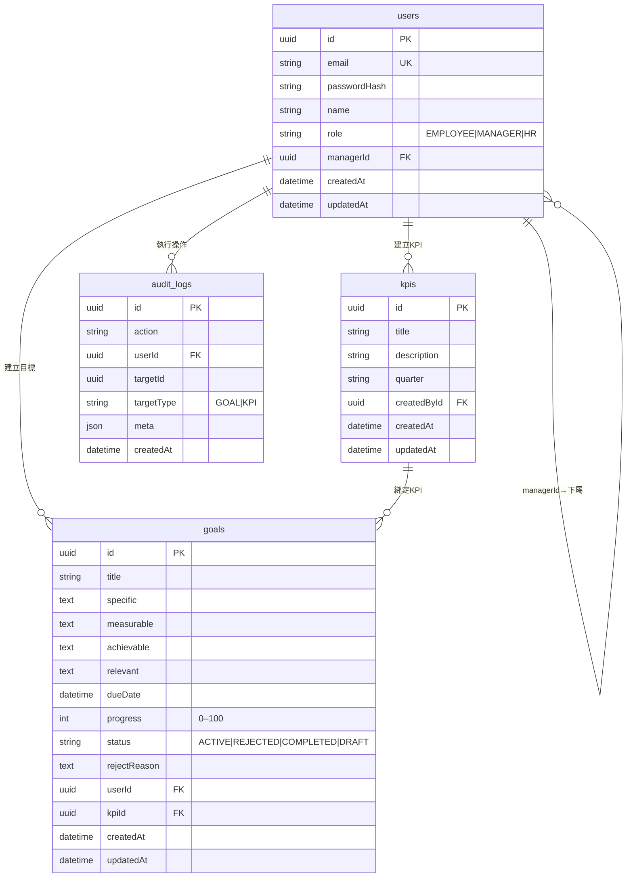
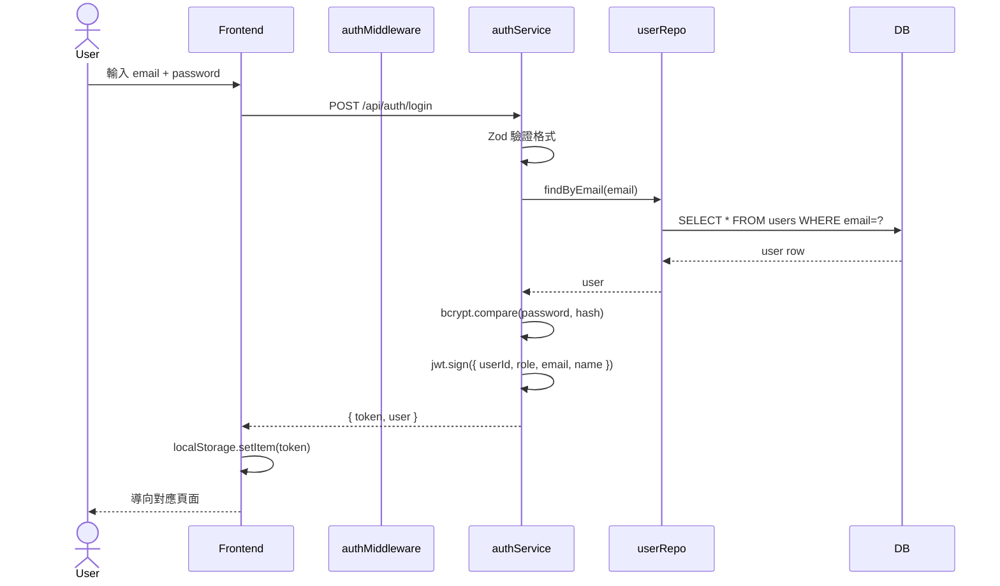
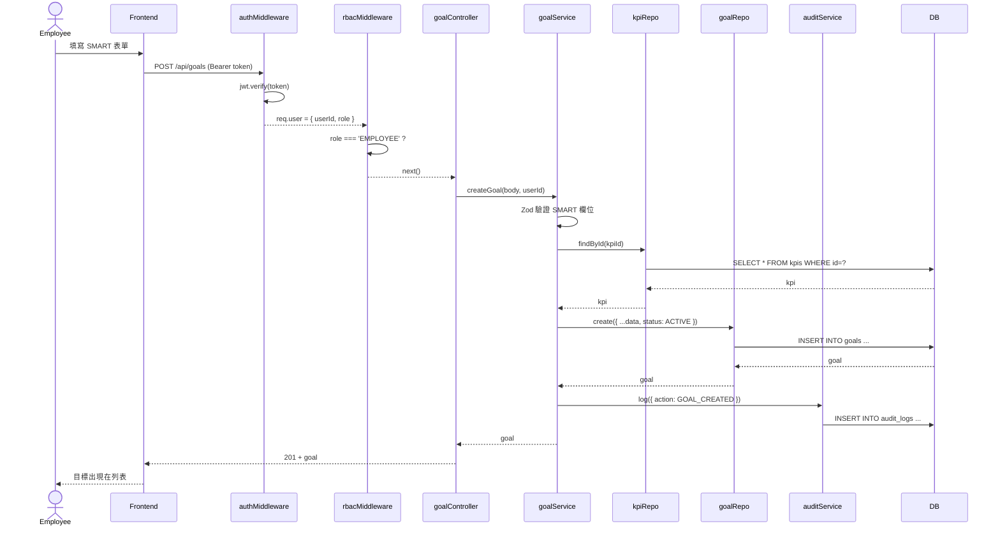
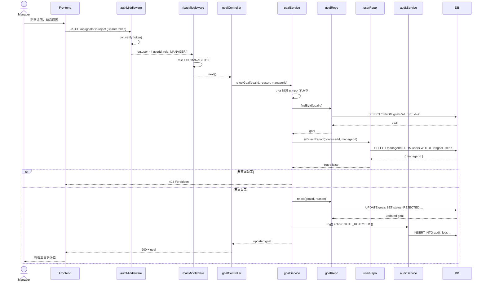
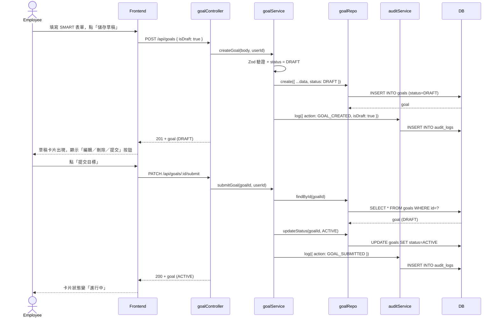

# Architecture — Performance Management System (Phase 1)

## 系統概覽

這是一個角色導向的績效管理系統，員工可以設定 SMART 目標、主管可以審核與退回目標、HR 可以管理 KPI。Phase 1 採用 **Modular Monolith**（模組化單體）架構。

---

## 一、整體架構分層

```
HTTP Request
     │
     ▼
┌─────────────────────────────────┐
│         Express Router          │  ← 路由分發 (authRoutes / goalRoutes / kpiRoutes)
└─────────────────────────────────┘
     │
     ▼
┌─────────────────────────────────┐
│        Middleware 層            │
│  authMiddleware → rbacMiddleware│  ← 先驗身份，再驗角色
└─────────────────────────────────┘
     │
     ▼
┌─────────────────────────────────┐
│        Controller 層            │  ← 解析 req，呼叫 Service，回傳 res
└─────────────────────────────────┘
     │
     ▼
┌─────────────────────────────────┐
│         Service 層              │  ← 商業邏輯：驗證、狀態轉換、Audit Log
└─────────────────────────────────┘
     │
     ▼
┌─────────────────────────────────┐
│       Repository 層             │  ← 資料存取，只負責 SQL（透過 Prisma）
└─────────────────────────────────┘
     │
     ▼
┌─────────────────────────────────┐
│      PostgreSQL 15 (Docker)     │  ← 實際資料儲存
└─────────────────────────────────┘
```

每一層只能往下呼叫，不能跨層。Controller 不碰 DB，Service 不管 HTTP。

---

## 二、請求流程（逐步說明）

### 2-1. 所有 API 的共同流程

```
Client
  │  POST /api/auth/login      → 不需要 token（唯一例外）
  │  其他所有 /api/* 請求       → 必須帶 Authorization: Bearer <JWT>
  ▼
authMiddleware
  │  讀取 Header 的 Bearer token
  │  用 JWT_SECRET 驗簽
  │  成功 → req.user = { userId, email, role, name }
  │  失敗 → 401
  ▼
rbacMiddleware（只有有角色限制的路由才掛）
  │  檢查 req.user.role 是否在允許清單內
  │  不符 → 403
  ▼
Controller
  │  取出 req.body / req.params / req.user
  │  呼叫對應 Service 方法
  │  回傳 HTTP 狀態碼 + JSON
  ▼
Service
  │  Zod 驗證輸入格式
  │  執行商業規則（見下方各流程）
  │  呼叫 Repository 讀寫資料
  │  寫 Audit Log
  ▼
Repository
  │  Prisma ORM → SQL → PostgreSQL
  ▼
回傳資料，逐層往上包裝成 HTTP response
```

---

### 2-2. 登入流程（POST /api/auth/login）

```
Client 傳入 { email, password }
  │
  ▼
authService.login()
  ├─ Zod 驗證：email 格式正確、password 不為空
  ├─ userRepo.findByEmail(email)         → 查 DB 找使用者
  ├─ 找不到 → 401 Invalid credentials
  ├─ bcrypt.compare(password, hash)      → 比對密碼雜湊
  ├─ 密碼錯 → 401 Invalid credentials
  └─ jwt.sign({ userId, email, role, name }, JWT_SECRET)
       → 回傳 { token, user }
```

登入成功後，client 把 token 存起來，後續每個請求都放在 Header：
`Authorization: Bearer eyJhbGci...`

---

### 2-3. 建立目標流程（POST /api/goals）— 限 EMPLOYEE

```
Client 傳入 {
  title, specific, measurable, achievable, relevant,
  dueDate, kpiId
}
  │
  ▼
authMiddleware → 取出 req.user.userId
rbacMiddleware → 確認 role === 'EMPLOYEE'
  │
  ▼
goalService.createGoal(data, userId)
  ├─ Zod 驗證所有 SMART 欄位不為空
  ├─ Zod 驗證 dueDate 是 ISO datetime 格式
  ├─ kpiRepo.findById(kpiId)             → KPI 必須存在
  ├─ 不存在 → 404 KPI not found
  ├─ goalRepo.create({ ...data, userId, status: 'ACTIVE' })
  └─ auditService.log({ action: 'GOAL_CREATED', userId, targetId: goal.id })
       → 回傳 201 + 新建立的 goal
```

---

### 2-4. 更新進度流程（PATCH /api/goals/:id/progress）— 限 EMPLOYEE

```
Client 傳入 { progress: 60 }
  │
  ▼
goalService.updateProgress(goalId, { progress }, requestingUserId)
  ├─ Zod 驗證：progress 是整數且介於 0–100
  ├─ goalRepo.findById(goalId)           → 目標必須存在
  ├─ 不存在 → 404
  ├─ goal.userId !== requestingUserId → 403（不能改別人的目標）
  ├─ goal.status === 'REJECTED' → 400（已退回的目標不能更新）
  ├─ goalRepo.updateProgress(goalId, progress)
  │    └─ progress >= 100 → status = 'COMPLETED'
  │       progress < 100  → status = 'ACTIVE'
  └─ auditService.log({ action: 'GOAL_PROGRESS_UPDATED', ... })
       → 回傳 200 + 更新後的 goal
```

**關鍵規則：進度到 100 自動完成，不需要手動改狀態。**

---

### 2-5. 主管退回目標（PATCH /api/goals/:id/reject）— 限 MANAGER

```
Client 傳入 { reason: "目標不夠具體" }
  │
  ▼
rbacMiddleware → 確認 role === 'MANAGER'
  │
  ▼
goalService.rejectGoal(goalId, { reason }, managerId)
  ├─ Zod 驗證：reason 不為空字串
  ├─ goalRepo.findById(goalId)           → 目標必須存在
  ├─ 不存在 → 404
  ├─ userRepo.isDirectReport(goal.userId, managerId)
  │    → 查 DB 確認 goal 的擁有者 managerId 是否等於當前登入的 manager
  ├─ 不是直屬 → 403（不能退回非直屬員工的目標）
  ├─ goalRepo.reject(goalId, reason)     → status = 'REJECTED'
  └─ auditService.log({ action: 'GOAL_REJECTED', ... })
       → 回傳 200 + 退回後的 goal
```

**isDirectReport 的邏輯：** `SELECT * FROM users WHERE id = goal.userId AND managerId = managerId`

---

### 2-6. 主管查看團隊目標（GET /api/goals/team）— 限 MANAGER / HR

```
  ▼
goalService.getTeamGoals(managerId)
  ├─ goalRepo.findByManagerId(managerId)
  │    → 撈出所有 user.managerId = managerId 的目標
  ├─ userRepo.findReportsByManagerId(managerId)
  │    → 撈出所有直屬員工清單
  ├─ 計算 alignment：
  │    aligned = 員工中「至少有一個非 REJECTED 目標」的人數
  │    percentage = aligned / total * 100
  └─ 回傳 { goals: [...], alignment: { total, aligned, percentage } }
```

---

## 三、資料庫 ER 關係

```
User ──< Goal          一個使用者可以有多個目標
User ──< Kpi           HR 可以建立多個 KPI
Goal >── Kpi           每個目標對應一個 KPI
User ──< AuditLog      每個操作記錄誰做的
User >── User          自我關聯：manager → reports（一個主管有多個下屬）
```

### 資料表重點欄位

| 表 | 重點欄位 | 說明 |
|----|---------|------|
| users | role (EMPLOYEE/MANAGER/HR) | 決定能做什麼操作 |
| users | managerId | 指向上層主管，實現組織階層 |
| goals | status (DRAFT/ACTIVE/REJECTED/COMPLETED) | 目標生命週期 |
| goals | progress (0–100) | 達 100 自動轉 COMPLETED |
| goals | rejectReason | 退回時填寫 |
| kpis | quarter (格式: 2026Q2) | 季度篩選用 |
| audit_logs | 無 updatedAt | Append-only，不允許修改 |

---

## 四、角色權限對照表

| 操作 | EMPLOYEE | MANAGER | HR |
|------|----------|---------|-----|
| 登入 | ✅ | ✅ | ✅ |
| 查看自己的目標 | ✅ | ✅ | ✅ |
| 建立目標（直接提交） | ✅ | ❌ | ❌ |
| 建立目標（存草稿） | ✅ | ❌ | ❌ |
| 編輯草稿 | ✅（只能自己的） | ❌ | ❌ |
| 刪除草稿 | ✅（只能自己的） | ❌ | ❌ |
| 提交草稿 | ✅（只能自己的） | ❌ | ❌ |
| 更新進度 | ✅（只能自己的） | ❌ | ❌ |
| 查看團隊目標 | ❌ | ✅（不含草稿） | ✅（不含草稿） |
| 退回員工目標 | ❌ | ✅（只能直屬） | ❌ |
| 建立 KPI | ❌ | ❌ | ✅ |
| 查看 KPI | ✅ | ✅ | ✅ |

---

## 五、Audit Log 設計

每一個重要操作都會寫一筆 audit_log，**只能新增，不能修改或刪除**（表上沒有 updatedAt）。

| action | 觸發時機 |
|--------|---------|
| GOAL_CREATED | 員工建立新目標（含草稿） |
| GOAL_SUBMITTED | 員工提交草稿目標 |
| GOAL_PROGRESS_UPDATED | 員工更新進度 |
| GOAL_REJECTED | 主管退回目標 |
| KPI_CREATED | HR 建立 KPI |

---

## 六、JWT Token 內容

登入後取得的 token decode 後包含：

```json
{
  "userId": "uuid",
  "email": "employee@test.com",
  "role": "EMPLOYEE",
  "name": "Employee User",
  "iat": 1234567890,
  "exp": 1234654290
}
```

authMiddleware 驗簽後把這份資料掛在 `req.user`，後續 Controller 和 Service 直接用 `req.user.userId`、`req.user.role`，不需要再查 DB。

---

## 七、目錄結構

```
backend/src/
├── app.js                  ← Express 初始化、掛 middleware、掛路由
├── index.js                ← 啟動 server（監聽 port）
├── routes/
│   ├── authRoutes.js       ← POST /api/auth/login
│   ├── goalRoutes.js       ← GET/POST/PATCH /api/goals/*
│   └── kpiRoutes.js        ← GET/POST /api/kpis
├── controllers/
│   ├── authController.js   ← 解析 req → 呼叫 authService
│   ├── goalController.js   ← 解析 req → 呼叫 goalService
│   └── kpiController.js    ← 解析 req → 呼叫 kpiService
├── middleware/
│   ├── authMiddleware.js   ← 驗 JWT，失敗 401
│   ├── rbacMiddleware.js   ← 驗角色，失敗 403
│   └── errorMiddleware.js  ← 全域錯誤處理
├── services/
│   ├── authService.js      ← 登入邏輯、密碼比對、JWT 簽發
│   ├── goalService.js      ← 目標 CRUD、進度更新、退回、alignment 計算
│   ├── kpiService.js       ← KPI 建立與查詢
│   └── auditService.js     ← 寫 Audit Log
└── repositories/
    ├── prismaClient.js     ← 單例 PrismaClient
    ├── userRepo.js         ← User 查詢、isDirectReport
    ├── goalRepo.js         ← Goal CRUD、findByManagerId
    ├── kpiRepo.js          ← KPI 查詢
    └── auditRepo.js        ← AuditLog create（只有新增）
```

---

## 八、ER Diagram



---

## 九、Sequence Diagram

### 9-1. 登入流程



### 9-2. 員工建立目標流程



### 9-3. 主管退回目標流程



### 9-4. 草稿建立與提交流程


